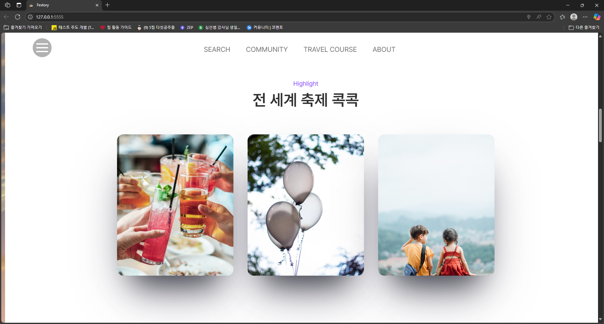
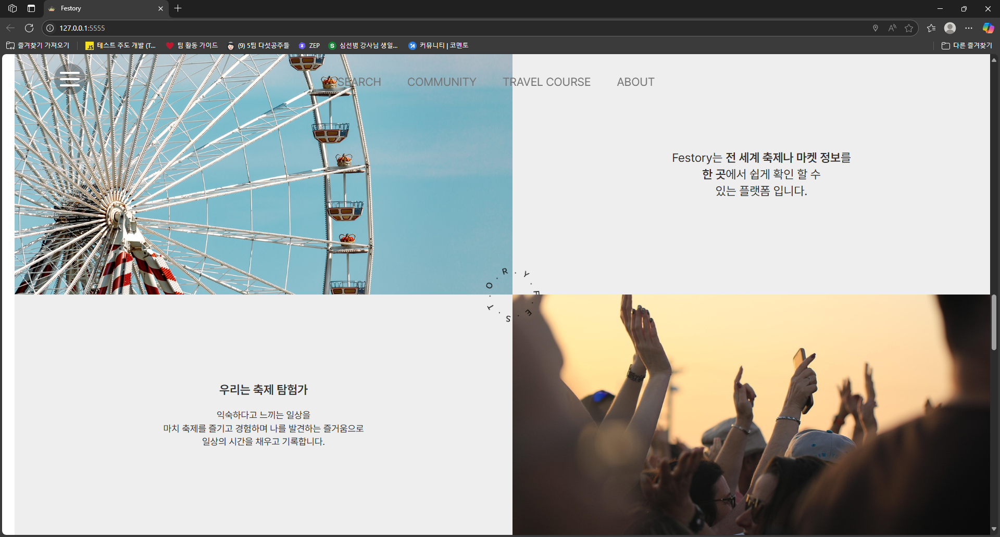
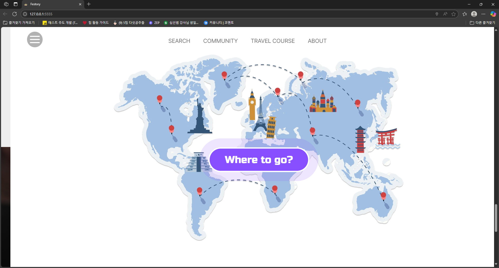
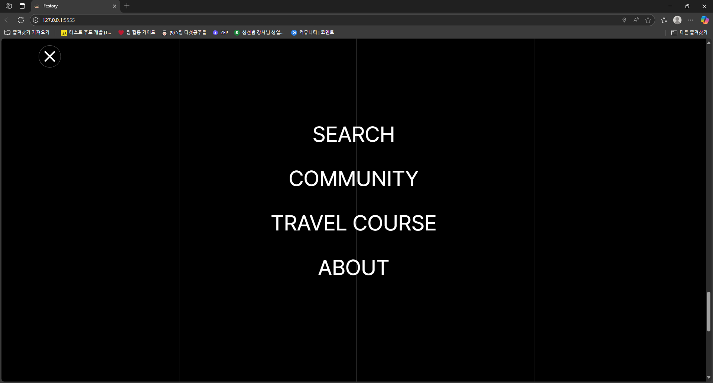
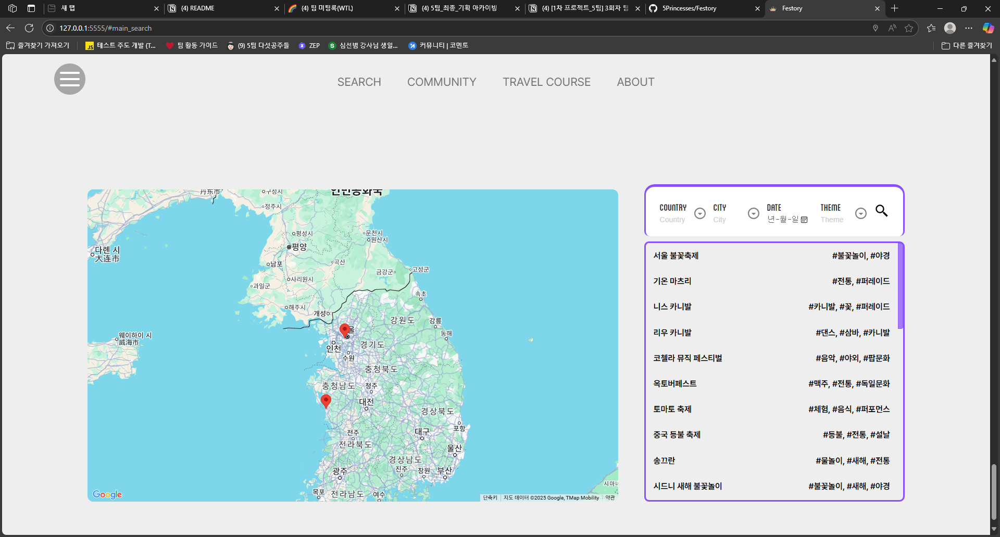
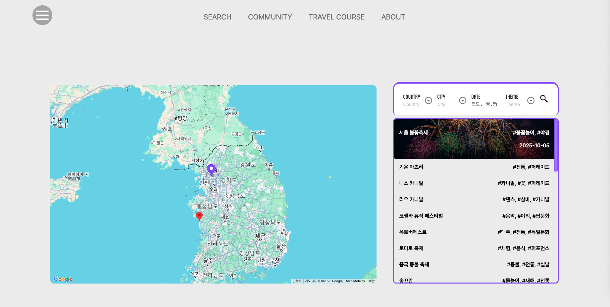
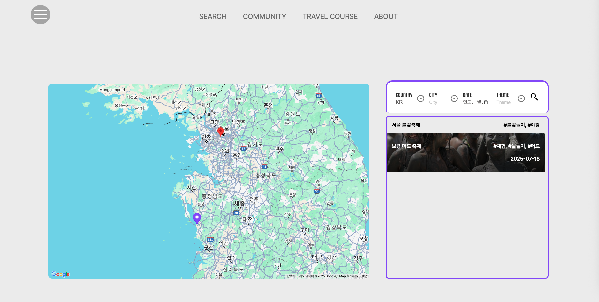
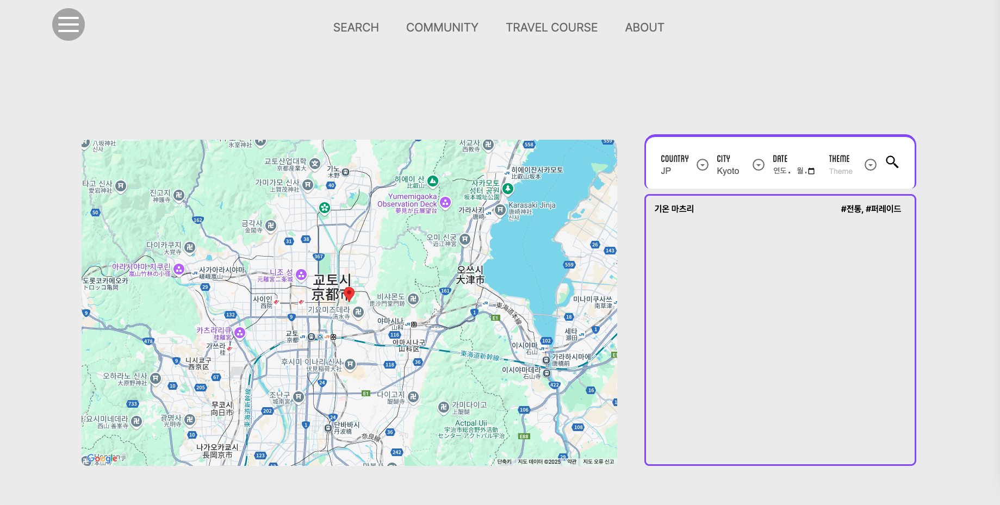
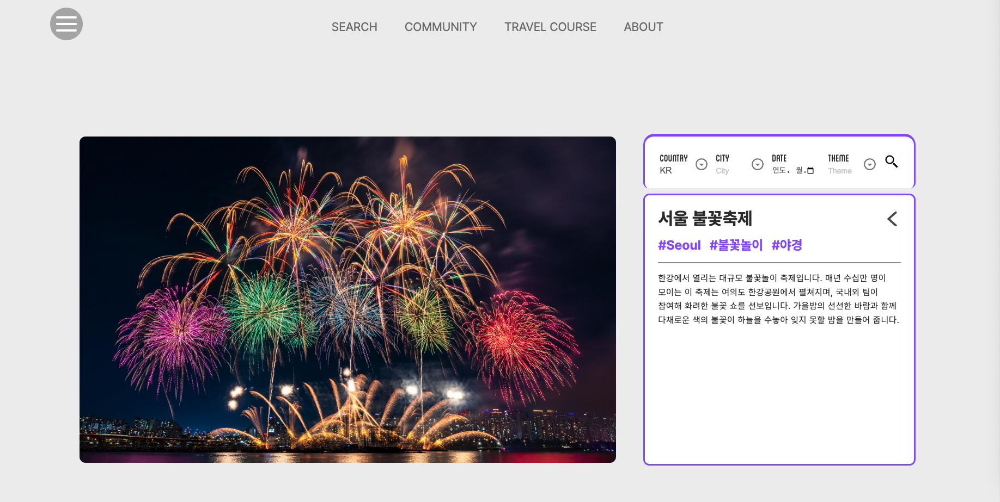

# 👑 프로그래머스 데브코스 FE 5기 - 5팀 [ 다섯 공주들 ]

## 📌 서비스 소개

**Festory**는 전 세계의 다양한 축제와 마켓 정보를 한눈에 확인할 수 있는 플랫폼입니다.

단순한 정보 제공을 넘어, 유저의 실제 경험과 후기를 공유할 수 있는 공간을 제공하며, 사용자 맞춤형 축제 추천 기능까지 준비 중인 서비스입니다.

지도 기반 UI를 통해 직관적인 검색과 필터링이 가능하며, 생생한 인터랙션과 애니메이션으로 여행을 준비하는 순간마저 즐겁게 만들어줍니다.

## 🎯 프로젝트 목적

- **여행 중 신뢰할 수 있는 축제/마켓 정보의 부재**  
  기존 정보는 광고성이 짙거나 신뢰도가 낮은 경우가 많아, 사용자들은 실제 후기를 찾기 어렵습니다.  
  👉 *Festory는 실제 유저들의 경험을 바탕으로 한 신뢰도 높은 축제 정보를 제공합니다.*

- **과도한 정보량과 산발적인 정보 구조**  
  구글 검색만으로는 국가별, 테마별, 일정별 축제를 정리하기 어렵고 시간이 많이 소요됩니다.  
  👉 *필터 기능과 지도 시각화를 통해 직관적이고 빠르게 정보를 탐색할 수 있도록 합니다.*

- **전 세계 축제 정보를 한 곳에서 보기 어려움**  
  대한민국 중심의 플랫폼은 있지만, 글로벌 축제와 마켓 정보를 아우르는 서비스는 드뭅니다.  
  👉 *Festory는 세계 각지의 로컬 마켓, 축제, 팝업 행사 등을 한 플랫폼에 통합합니다.*

- **축제 추천 서비스의 부재**  
  개인의 취향이나 여행 성격에 맞는 축제를 제안해주는 시스템이 없습니다.  
  👉 *성격 테스트 기반의 ‘나에게 맞는 축제/마켓’ 추천 기능을 통해 맞춤형 여행 계획을 지원합니다.*

- **정보 소비만이 아닌, 경험 공유의 장 마련**  
  유저가 직접 다녀온 축제 정보를 공유하고, 팁을 나눌 수 있는 공간이 부족합니다.  
  👉 *노션 기반 커뮤니티 기능을 통해 사용자 중심의 정보 순환 생태계를 구축합니다.*

---

## 주요 기능
- 전 세계 축제 검색
- 지역별, 날짜별 필터링
- 축제 위치에 따른 지도 마킹
- 클릭시 축제에 대한 소개

---

## 사용 방법
1. 스크롤을 따라 메인 검색 화면까지 이동하세요.
2. 메인 화면에서 축제를 검색하세요.
3. 지도에서 축제 위치를 확인하세요.
4. 원하는 축제를 선택해 일정과 상세 정보를 확인하세요.


---

## 👩‍👩‍👧‍👧 참여 팀원

- **효영공주(?)** : 데이터 생성 및 데이터 호출 함수 제작 / 축제 Info 카드 제작
- **수진공주** : 지도 UI 제작
- **유하공주** : 축제 정보 리스트 제작
- **은정공주** : 페이지 레이아웃 제작 / UI/UX 플로우 설계
- **은빈공주** : 축제 필터링 제작

---

## 🛠 사용 기술 스택

- 
- 
- 
- **GSAP** – 서비스 내 애니메이션

---

## 📁 프로젝트 구조
```
📦 프로젝트 루트/
├── 📁 assets/              # 이미지, 영상 등 정적 리소스
│   └── ...
├── 📁 css/                 # CSS 파일
│   ├── reset.css
│   └── style.css
├── 📁 js/                  # JS 모듈 폴더
│   ├── 📁 components     # 컴포넌트 폴더
│   └── ...                # 기타 유틸 폴더, 데이터 폴더
├── .gitignore             # Git 추적 제외 설정
├── index.html             # 진입 HTML 파일
├── main.js                # 메인 스크립트
├── package.json           # 프로젝트 설정 및 의존성 정보
├── package-lock.json      # 의존성 버전 고정 (npm 사용 시)
└── README.md              # 프로젝트 소개 문서 (현재 파일)
```
---

## ✅ 메인 페이지 기능 및 UI

### 🔹 인트로 페이지 기능 및 UI

- **기능**: GSAP를 활용한 horizontal scroll
- **기술 포인트**:

1. 브랜드 아이덴티티 및 동영상
	- 로고와 메인 동영상으 통해 사이트의 정체성과 목적을 시각적으로 전달합니다.
   
2. 카드형 슬로건
	- 형태로 시각적으로 배치해 정보 전달을 합니다.

3. 강조된 버튼 및 CTA
	- 사용자의 행동을 유도하는 버튼을 눈에 띄게 배치합니다.

4. 마이크로 애니메이션
	- 메뉴 등 주요 인터랙션 요소에 마이크로 애니메이션을 적용해 사용자의 행동에 즉각적인 피드백을 제공합니다.


- 스크린샷 :

  
  
  
  
  
  

## ✅ SEARCH 페이지 기능 및 UI

- **기능**: `지도 기반 축제 정보 확인`, `필터 기능`, `축제 리스트 출력`, `마우스 인터랙션`, `마커 강조`, `애니메이션 처리`.
- **기술 포인트**:

1. `지도 기반 렌더링`: Google Maps API를 활용해, 전 세계 축제 위치를 마커로 표시하며 초기 지도 중심은 사용자의 현재 위치로 설정.

2. `필터링 기능`: 국가, 도시, 날짜, 테마 필터를 조합해 조건에 맞는 축제를 리스트업하며, 필터는 독립적으로 작동해 하나만 선택해도 검색 가능.

3. `마커와 리스트 연동`: 축제 리스트에서 특정 항목에 마우스를 올리면 해당 축제의 지도 마커가 색상 변화로 강조되며, 클릭 시 포커싱 처리.

4. `리스트 애니메이션`: 축제 리스트 항목에 hover 시 날짜 정보가 나타나며, 리스트 높이 및 마커와의 상호작용을 포함한 마이크로 인터랙션 구현.

5. `지도 자동 범위 조절`: 필터링된 축제들만을 포함하는 마커 범위를 기반으로 지도의 줌/중심을 자동 조정하여 사용자 편의성 확보.

6. `축제 정보 상세 카드`: 축제 이름, 카테고리, 설명을 포함한 축제 카드가 부드러운 로딩 애니메이션과 함께 출력되며 직관적인 UI 제공.

7. `드롭다운 필터 UI`: 테마나 국가 선택 시 드롭다운이 자연스럽게 열리고 닫히는 인터랙션 구성으로 사용자 흐름 방해 없이 정보 탐색 가능.


**스크린샷**:






---


https://github.com/user-attachments/assets/95650f0f-49b7-47b1-a511-8296d6c1eec3


---

## 🚀 실행 방법

```bash
git clone https://github.com/programmers-todoList/main
cd main
npm i
npm run dev
# index.html 파일을 브라우저로 열면 실행됩니다.

